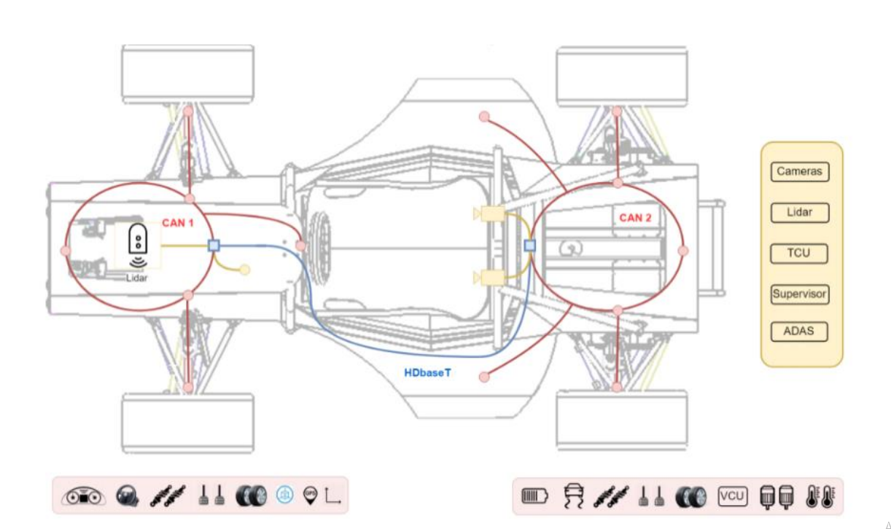

# RACE-CAR

This repository contain my Academic engineering final project, which try to suggest a method of organizing information traffic in autonomous vehicles,

The problem I wanted to solve is how to expand the current communication method to support Advanced Drive assist application.

The proposed solution is to build a network built from a combination of CAN bus and Ethernet interfaces, were Ethernet used as backbone.

To bridge between the two interfaces I suggested to add dedicated module That I call  "Gateway Node",

The Gateway Node aim to manage the car data traffic and with him create a hierarchical Democratic multi master network were every node can exchange data.

### Network components

### Network concept

### Gateway Node 3D Model

I design and implement the network module "Gateway Node"

To meet the requirements of critical information passing through a vehicle, the Ethernet interface supports the AVB protocol to Ensure real time policy. [Link to PCB repository ](https://github.com/guyg3333/AVB_Ethernet_switch_with_CAN_bus)

### CAN Node 3D Model

### Ben Gurion Racing

The component was assimilated in Ben-Gurion University FSAE electric car in 2019
